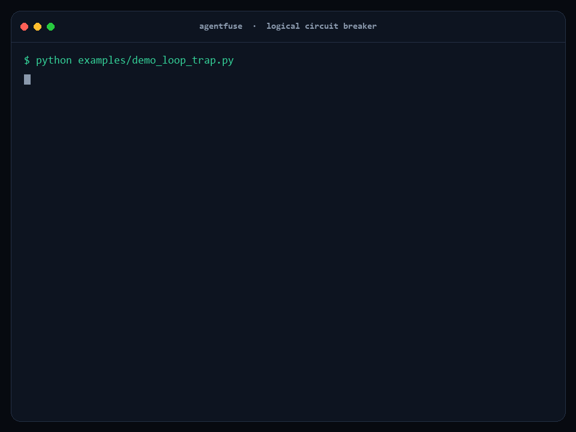

# ⚡ AgentFuse — a Logical Circuit Breaker for Long-Range Agents

> Autonomy that knows when it's going wrong — and steers itself back.



**▶ Live observability dashboard:** https://ns-0437.github.io/agentfuse/ — explore every supervised run (timeline, trips, steering recoveries, token spend) right in the browser.

**📄 [Full project report](REPORT.md)** — every result to date, phase status, and an
honest readiness assessment, including the measurement showing the deterministic
templates currently beat the only real model tested.

Long-running agents (hours → days, hundreds of steps) don't usually fail with a
crash. They fail *quietly*: an infinite tool loop, a slow drift from the original
objective, a logical trap where the model reasons flawlessly from a false premise,
or a budget silently burned to zero. The agent that drifted is the **worst possible
judge** of whether it drifted.

**AgentFuse is a supervisor that sits *above* the agent's execution graph.** It
watches the telemetry every framework already emits — tool calls, graph routes,
state changes, token spend — and **trips a circuit breaker** the moment a
long-horizon failure mode crosses a threshold. On a trip it freezes state and asks
a **separate reasoning model** for a *steering recovery path*, injects that
correction, and resumes. When recovery isn't safe, it **escalates to a human**
instead of blindly retrying.

One engine. Three runtimes: **OpenAI AgentKit** (first-class), plain **OpenAI SDK**,
and **LangGraph**.

---

## Why this wins where it's judged

| Theme | How AgentFuse fits |
|---|---|
| **Observability** *(primary)* | Live trace of every graph route, state delta, tool signature, and token/$ spend, streamed to console **and** JSONL for any backend. This is agent observability — but *active*, not a passive dashboard. |
| **Security / Safety** *(secondary)* | A hard stop for runaway autonomy: budget ceilings, loop guards, and human escalation prevent an unattended agent from spending or acting without bound. |

The differentiator: most observability tools *watch*. AgentFuse **watches and
intervenes** — a closed-loop, self-healing safety layer.

---

## 60-second demo (no API key, nothing to install)

The core is **stdlib-only**. Clone and run:

```bash
python examples/demo_loop_trap.py     # infinite tool loop -> detected -> self-healed
python examples/demo_drift.py         # goal drift -> re-anchored to objective
python examples/demo_escalation.py    # unrecoverable failure -> hard stop / human escalation
```

Each prints a live trace and writes a machine-readable `runs/*.jsonl`.
`pip install rich` for colored panels; set `OPENAI_API_KEY` to swap the offline
mock for a real reasoning model + real embedding-based drift detection.

### Real AgentKit run (not simulated)

```bash
pip install openai-agents
python examples/real_agentkit_run.py
```

This drives the **genuine `openai-agents` SDK** — a real `Agent`, real
`@function_tool`s, the real `Runner`, and AgentFuse's real `FuseRunHooks`
observing the live lifecycle. The agent falls into a real infinite tool loop;
the breaker — watching the actual SDK hooks — **trips, aborts the runaway run,
injects a steering instruction into the conversation, and re-runs**, after which
the agent completes. Only the model's token generation is stubbed (a
`ScriptedModel`) so the run is free; pointing it at a real model is a one-line
change (drop the `RunConfig` override, set `OPENAI_API_KEY`) — the hooks and
breaker code are byte-for-byte identical.

### What you see

```
🔧 step 1  tool_call   search_files({"dir":"./config","pattern":"*.conn"})
🔧 step 2  tool_call   search_files({"dir":"./config","pattern":"*.conn"})
🔧 step 3  tool_call   search_files({"dir":"./config","pattern":"*.conn"})
┌── ⚡ CIRCUIT BREAKER TRIPPED - LOOP (trip) ──────────────────────────────┐
│ Tool 'search_files' called with identical arguments 3x, no state progress │
└───────────────────────────────────────────────────────────────────────────┘
┌── 🧭 STEERING RECOVERY - action=inject (via o4-mini) ─────────────────────┐
│ STOP repeating `search_files`… re-read your objective… try another path.  │
└───────────────────────────────────────────────────────────────────────────┘
▶️  step 3  resume      steering injected; agent resuming with corrected plan
🔧 step 4  tool_call   secret_manager.get({"name":"prod/db/primary"})   ← recovered
✅ step 5  complete     objective achieved after self-healing
```

---

## Architecture

```
        ┌──────────────── AGENT EXECUTION GRAPH ────────────────┐
        │   parallel nodes · tool calls · handoffs · state Δ    │
        └────────────────────────┬──────────────────────────────┘
              emits AgentEvents   │  (tool / route / state / spend)
                                  ▼
        ┌──────────── CircuitBreakerMonitor (supervisor) ───────┐
        │  Detectors (independent sensors):                     │
        │    • LoopDetector        repetitive tool signatures   │
        │    • DriftDetector       goal vs. system-prompt dist. │
        │    • NoProgressDetector  activity w/ no state change  │
        │    • RateOfProgressDet.  state moving, never arriving │
        │    • SpendDetector       token/$ ceiling + burn rate  │
        └────────────────────────┬──────────────────────────────┘
                     trip!        │  freeze ExecutionSnapshot
                                  ▼
        ┌──────────── RecoveryEngine (SEPARATE model) ──────────┐
        │  reasoning model → SteeringPath                       │
        │    { inject correction · escalate to human · abort }  │
        └────────────────────────┬──────────────────────────────┘
                                  ▼
                 Directive → adapter injects steering & resumes
```

Design principle: **the thing judging the run is never the thing performing it.**
Detectors are independent and composable; adding a new failure-mode sensor is one
class implementing `inspect(event, history) -> Trip | None`.

---

## Use it with your framework

### OpenAI AgentKit (first-class, real `RunHooks`)

`FuseRunHooks` is a genuine `agents.RunHooks` subclass — pass it straight to
`Runner.run`. It observes the live lifecycle and raises `BreakerInterrupt` to
abort a runaway run so you can inject steering and re-run. See a complete,
runnable end-to-end integration in
[`examples/real_agentkit_run.py`](examples/real_agentkit_run.py).

```python
from agents import Agent, Runner
from agentfuse.adapters.agentkit_hooks import FuseRunHooks, BreakerInterrupt
from agentfuse import DirectiveKind

agent = Agent(name="rotator", instructions=GOAL, tools=[...])
fuse = FuseRunHooks(original_goal=GOAL, loop_threshold=3, max_tokens=500_000)

input_items = [{"role": "user", "content": TASK}]
while True:
    try:
        result = await Runner.run(agent, input_items, hooks=fuse, max_turns=12)
        fuse.finish(); break
    except BreakerInterrupt as bi:
        if bi.directive.kind is DirectiveKind.INJECT:
            input_items.append({"role": "user",
                                "content": f"[CIRCUIT BREAKER STEERING] {fuse.take_steering()}"})
            continue          # re-run with the corrective nudge
        fuse.finish("escalated"); break   # PAUSE / ABORT -> hand to a human
```

### Plain OpenAI SDK (framework-free)

```python
from openai import OpenAI
from agentfuse.adapters.openai_sdk import guarded_tool_loop

guarded_tool_loop(OpenAI(), model="gpt-4.1", system_prompt=GOAL,
                  user_input=TASK, tools=TOOLS, tool_router=run_tool,
                  max_tokens=200_000)   # breaker steers the loop automatically
```

### LangGraph

```python
from agentfuse.adapters.langgraph import FuseCallbackHandler
handler = FuseCallbackHandler(original_goal=GOAL)
graph.invoke(state, config={"callbacks": [handler]})
# add handler.supervisor_node as a node to inject steering between agent turns
```

### Surviving a restart

A supervisor that forgets everything on restart doesn't just lose convenience —
it loses the ceiling. An agent with a 500,000-token budget that dies at 480,000
would come back with its budget at **zero**, so the restart *rearmed* the guard
instead of enforcing it.

```python
mon = CircuitBreakerMonitor(MonitorConfig(
    original_goal=GOAL, max_tokens=500_000,
    checkpoint_path="runs.db",      # stdlib sqlite3, WAL — survives a hard kill
    run_id="nightly-reconcile",     # what to resume
))
mon.restore()                       # picks up spend, loop counters, calibration
```

Off by default. Always checkpoints on a trip regardless of interval, since that's
the state a crash most often follows and the costliest to lose — it carries the
recovery ladder's position.

### Spending real money

`max_cost_usd` needs to know what your tokens cost. **Pass `model=`, or the
ceiling cannot be enforced** — and it will say so rather than silently reporting
`$0.00`:

```python
MonitorConfig(original_goal=GOAL, max_cost_usd=25.0, model="gpt-4.1")
```

An unknown model is **never priced at zero**. Unpriced tokens are counted
separately, `cost_is_complete` goes false, and an unenforceable ceiling warns at
construction. Prices go stale, so the bundled table is a dated convenience
default — override it with no code change:

```bash
AGENTFUSE_PRICING_FILE=my_prices.json   # {"gpt-4.1": {"input_per_1m": 2.0, "output_per_1m": 8.0}}
```

These are guardrail estimates, not billing figures; they will not reconcile with
an invoice.

### Escalating to a human who is asleep

`escalate` used to mean printing to a console that, on an unattended overnight
run, nobody is reading. Point it somewhere real:

```python
MonitorConfig(
    original_goal=GOAL,
    escalation_webhook="https://hooks.slack.com/services/…",  # any JSON endpoint
    escalation_include_agent_text=False,   # keep the trace off the wire
)
```

**Delivery is verified, not assumed.** `finish()` reports `escalation_delivered`:
`None` means never needed, `False` means needed and **nobody was told**. A webhook
outage never propagates — bounded timeout, two retries, and it returns false
rather than raising.

The payload carries the agent's reasoning, so it's treated as egress: free text is
sanitised and truncated, and `escalation_include_agent_text=False` drops it while
still identifying the run.

### Low-level (any runtime)

```python
from agentfuse import CircuitBreakerMonitor, MonitorConfig, AgentEvent, EventType, DirectiveKind

mon = CircuitBreakerMonitor(MonitorConfig(original_goal=GOAL, max_tokens=200_000))
d = mon.observe(AgentEvent(type=EventType.TOOL_CALL, step=n,
                           tool_name="search", tool_args={"q": q}))
if d.kind is DirectiveKind.INJECT:
    agent.add_system_message(d.steering_text)
```

---

## What each detector catches

| Detector | Failure mode | Trip condition |
|---|---|---|
| `LoopDetector` | Infinite / repetitive tool loop | Same `(tool, args)` signature N× in a window with no state progress |
| `DriftDetector` | Goal drift | Semantic similarity to the original objective drops below threshold for K turns (real embeddings, or offline lexical fallback) |
| `NoProgressDetector` | Logical trap / stall | Many actions, zero change to working-state hash |
| `RateOfProgressDetector` | Zeno trap — advancing every step, arriving never | A run of formally identical advances where one reported quantity is pinned while another climbs past it, and nothing counts down or approaches a total |
| `SpendDetector` | Runaway cost | Cumulative token/$ ceiling (→ escalate) or burn-rate spike (→ steer). Pass `model=` so tokens can be priced — see below |

---

## Does it actually work? (measured, not claimed)

Most guardrail projects assert they work. This one is scored against a benchmark
with ground truth, confidence intervals, and a significance test — and the
numbers are published, including the unflattering ones.

```bash
python evals/run_eval.py --generated 40 --json    # 936 scenarios + ablation
python evals/run_eval.py --generated 40 --sweep   # threshold sweeps
python evals/validity.py                          # checks on the benchmark itself
pytest evals/ -q                                  # 164-test CI gate
```

**936 scenarios** from **21 parameterised generator families** across 6 domains,
with ground truth true *by construction*. 449 are genuine failures; **487 are
hard negatives** — healthy runs that look like failures: a legitimate retry,
polling that really is progressing, a sub-goal that reads as drift, a
**paraphrased objective**, an error followed by a competent pivot, a batch job
that repeats itself forever and is genuinely finishing. Hard negatives are what
make the false-positive rate measurable, and that rate decides whether anyone
leaves a guardrail switched on. Everything replays deterministically in ~30s —
no API key, no cost.

### Current baseline (2026-08-13, replay mode, local embeddings)

| Metric | Value | Prev | Read as |
|---|---:|---:|---|
| Recall | **97.6%** | 88.4% | real failures caught |
| Precision | **98.6%** | 90.9% | can you trust a trip |
| F1 | **98.1%** | 89.6% | |
| False-positive rate | **1.2%** | 8.9% | healthy runs halted |
| Attribution | **83.8%** | 84.0% | right detector named |
| Recovery rate | **67.6%** | 71.7% | caught failures put back on track |
| **Recall, cluster-adjusted** | **97.7% [94.8–99.0]** | 84.6% [57.8–95.7] | ← see the warnings below |

> **⚠ Do not read 98.1% F1 as "nearly production ready."** A benchmark you score
> 98% on has stopped being a measuring instrument. Six false positives and eleven
> false negatives is the entire remaining signal — it can no longer distinguish a
> good change from a neutral one. Part of this run's gain came from **fixing a
> generator that was wrong**: a legitimate correction with evidence (below), but
> making the test easier is exactly how benchmarks stop meaning anything, so it
> stays visible. These generators encode *one person's* model of agent failure,
> so what is measured here is self-consistency, not real-world coverage. The
> honest next move is harder and more realistic scenarios — ideally captured from
> real runs — not more tuning against this suite.

**⚠ The interval narrowed for the wrong reason.** Design effect fell 16.9× → 2.0×
and ICC 0.407 → 0.048, moving effective n from 13 to 222. That is a **ceiling
artifact, not new evidence**: 18 of 20 recall clusters are now all-successes, so
between-cluster variance has nowhere to live and the design effect collapses
toward 1 by construction. The suite went from 20 generator families to **21** —
that is the honest measure of how much independent evidence was added, and it is
one. Expect the interval to widen again the moment any family regresses.

The older lesson still holds: *adding scenarios per generator buys no statistical
power* — sweeping 40/20/10/5 per family moved effective n only 13→14. Only more
independent **families** narrow the interval.

### Against trivial baselines

Five detectors, a steering ladder, a memory and a calibrator have to beat "stop
after N steps" or the complexity is unjustified:

| System | Recall | Precision | F1 |
|---|---:|---:|---:|
| **AgentFuse** | 97.6% | **98.6%** | **98.1%** |
| step cap = 12 | 96.2% | 54.0% | 69.2% |
| naive repeat counter | 49.1% | 66.2% | 56.4% |

Note what this actually says: **a dumb step cap gets 96% recall.** What AgentFuse
buys is *precision* — not noticing failures, but not halting healthy runs.

### The rule that cost the most to learn

**A supervisor must not act on an action whose outcome it has not yet seen.**

A tool step emits `llm_call → tool_call → tool_result`. A detector that tests its
threshold on the *call* can halt a run one event before the result that would
have cleared it. This shipped in **two detectors independently**, and a test
written afterwards immediately found a **third** instance. Every time, the runs
it killed were ones that were **about to succeed** — an agent retrying a flaky
endpoint, halted on the final successful attempt.

That is the worst failure mode a guardrail has: not missing a problem, but
destroying work that was fine. It is now asserted for every stateful detector in
`evals/test_rate.py`. Fixing the progress-detector instance alone moved FPR from
7.4% to 4.1%.

**What's still broken, stated plainly:**

- **The benchmark is saturated** — 6 FPs and 11 FNs out of 936. It cannot measure
  further improvement, and that is now the top constraint on the project.
- **Subtle drift is the main real miss** (8 of 11 FNs, `gen_driftsub`), plus 6 FPs
  where a legitimate sub-goal reads as drift. Both sit on the ±0.043 embedding
  separation gap — the thinnest signal in the system.
- **A Zeno trap reporting a bare cursor is undetectable** — see below.
- **Domain packs have 4 tools and 4 argument dicts.** That low entropy makes every
  scenario less representative than it looks, and it silently corrupted one
  generator (below). The others have not been audited for the same problem.
- **`steering_usable = 100%` is circular** — that rubric scores instructions
  built from templates written alongside it. It is not evidence and is flagged as
  such in `baseline.json`.
- **Everything is synthetic** except one captured trace, which validates event
  *shape* against production, not the failure *distribution*.

### When the benchmark was the thing that was wrong

`gen_long_sparse_benign` was meant to be a healthy run with wide gaps between
milestones. Because each domain offers only 4 tools and 4 argument dicts, drawing
its "varied work" at random produced **3+ identical `(tool, args, result)` triples
in 199 of 200 runs** — worst case, the same call repeated **11 times** with no
state change, labelled healthy. That is a loop with a benign label, and it
accounted for 14 false positives no legitimate detector change could remove.

I tried a detector fix first — a first-cycle grace period on the loop detector.
After correcting the generator it measured **exactly zero effect**, so it was
removed rather than shipped. Both the correction and the discarded fix are
recorded, because "we made the test easier" is a claim that has to be auditable.

### Closing the Zeno trap — and what it cost to do honestly

The binary progress test asks *did the state advance?* An agent that advances on
**every** step and converges on none answers yes forever, so the stall counter is
reset every step and its trip condition is **structurally unreachable** — no value
of `stall_patience` reaches it. That capped the `progress` family at 67% and was
carried as a documented known gap rather than hidden.

`RateOfProgressDetector` closes it by asking whether the trace carries its own
evidence of converging. Two things silence it: a **countdown** (`214 remaining` →
`213 remaining`) or a **bounded approach** (`processed 7 of 240`, or any rising
percentage, which carries its ceiling in its unit).

The first version tripped on any unbounded rising counter — and the benchmark
immediately produced the counter-example:

| Trace | Verdict |
|---|---|
| `batch 0 done` … `batch 9 done` | healthy expensive work |
| `processed 1 of many (offset 9)` | Zeno trap |

Those are the *same evidence*: one climbing number against no ceiling. Firing on
it cost **44 false positives on healthy runs (FPR 8.9% → 17.0%)** and dropped
attribution to 69.8%. That is not a tuning problem, it is an **identifiability**
problem, so the detector now abstains there and fires only on the two-quantity
signature: one quantity *pinned* while another climbs past it — an agent
reporting, in its own output, that what it accomplishes per step is not growing.

The concession, stated rather than buried: **a Zeno trap that reports nothing but
a bare cursor will be missed.** That is a narrower claim than "the gap is closed",
and it is the one the evidence supports. `gen_benign_batch` — same shape as the
trap, genuinely converging — is the hard negative that keeps it honest.

Net effect: `progress` family **67% → 100%**, recall **88.4% → 97.6%**, F1
**89.6% → 94.6%**, FPR **8.9% → 8.0%**. Ablation puts its causal contribution at
**ΔF1 −4.8**, third largest of the five detectors.

### What the benchmark already changed

The threshold sweep found the shipped `drift_threshold=0.45` was badly wrong:

| drift_threshold | Recall | Precision | F1 | FPR |
|---:|---:|---:|---:|---:|
| 0.20 (**new default**) | 65.1% | 83.9% | **73.3%** | **10.8%** |
| 0.45 (old default) | 71.5% | 61.4% | 66.0% | 39.0% |

Six points of recall bought **28 points of false-positive rate**, took attribution
from 87% to 99.4%, and eliminated all 54 premature trips. That one-line change was
found by measurement, not intuition — which is the entire argument for building
this before building anything else.

### Drift needs a semantic signal — and the model size has a floor

Lexical similarity cannot separate the case that matters. Neither can a *small*
embedding model, which is the surprising part:

| Signal | on-task | paraphrase | **gradual drift** | Separable? |
|---|---:|---:|---:|---|
| lexical (difflib + Jaccard) | 0.323 | 0.332 | 0.276 | ~0.05 overlapping window |
| **bge-small-en-v1.5 (33M)** | 0.712 | 0.764 | **0.756** | ❌ **inverted** |
| **bge-base-en-v1.5 (110M)** | 0.708 | 0.769 | **0.665** | ✅ gap +0.043 |

The 33M model is not merely weaker — it scores gradual drift as *more* similar to
the objective than genuinely on-task text, so any threshold built on it fires
backwards. **110M is the floor; a billion parameters buys nothing here.**

This runs **locally and free**: `pip install agentfuse[embeddings]` pulls a
~120MB ONNX model that needs no API key, touches no network, and costs ~4ms per
sentence on CPU — faster than a hosted round trip, and the agent's reasoning
never leaves the machine. Drift-family recall went **76.2% → 90.0%**.

`AGENTFUSE_OFFLINE` disables only the *hosted* backend; a local model spends
nothing, so treating it as "offline" would force the weakest signal for no gain.

### Does the reasoning model actually beat a template? (measured — no)

This is the project's central premise: a **separate reasoning model** writes better
corrections than a fixed rule could. Until now it had never been tested. Every
recovery number came from the offline mock — a deterministic template picked by
rung, scored by a rubric written alongside those templates.

It is testable for free. `AGENTFUSE_LLM_BASE_URL` points the supervisor at any
OpenAI-compatible endpoint, so a local model on the same machine costs nothing:

```bash
pip install llama-cpp-python --extra-index-url https://abetlen.github.io/llama-cpp-python/whl/cpu
python -m llama_cpp.server --model models/qwen2.5-3b-instruct-q4_k_m.gguf --n_ctx 4096 --port 8080
python evals/real_model.py --n 4 --base-url http://127.0.0.1:8080/v1
```

Paired on identical trip snapshots, **Qwen2.5-3B-Instruct Q4** against the templates:

| | mock (templates) | real (Qwen 3B) |
|---|---:|---:|
| **usable rate** | **100%** | **25%** |
| mean quality | 89.2% | 74.2% |
| actionable | 100% | 60% |
| goal-anchored | 100% | 60% |
| diagnostic | 35% | 25% |
| latency | ~0 ms | 19.3 s |

**The templates win, decisively.** A bias was found on each side and fixed before
publishing this, because a result this unflattering deserves a real attempt to
overturn it:

- **Our prompt was wrong.** The model wrote *about* the intervention — `inject a
  new task to check if…` — addressed to the supervisor rather than to the agent.
  That instruction is pasted verbatim into the agent's conversation, so it is
  incoherent by the time anything reads it.
- **Our rubric was biased.** `_ACTIONABLE` matched `realign` but not `re-align`,
  and scored `do not repeat any previous actions involving searching files` — an
  explicit, named prohibition — as prescribing no action at all. It was
  recognising its own authors' vocabulary.

Both fixes helped (usable 15% → 20% → 25%). **The direction never changed.**

One failure mode is worse than being unhelpful. Told to forbid the failing
action, the model forbade *the objective*:

> "Do not repeat any steps involving credential rotation or updating app config
> until you receive further instructions from a human."

A weak supervisor does not merely fail to help — it can instruct the agent to
abandon its task.

**What this does and does not establish.** It does *not* show that
reasoning-model steering is a bad idea: a 3B Q4 model is the floor of what could
plausibly work, and the reasoning models the design assumes are untested. The
mock's 100% also remains circular. What it does establish is that **the ladder
templates have been carrying the recovery numbers all along**, and that the
central premise is still unproven rather than supported.

Getting an honest number needed three pieces of engineering, each found by
running it: self-hosted servers speak `/v1/chat/completions`, not the Responses
API; **grammar-constrained JSON** is mandatory (unconstrained, the same prompt
gave valid JSON one call and garbage the next, ~1 in 8 — constrained, 0/20
malformed); and `max_tokens` must be explicit or servers truncate mid-JSON. A
malformed real response now **raises** instead of quietly substituting the
template, because otherwise a broken backend is indistinguishable from a working
one and every number measures the templates again.

Still simulated: whether the agent *obeys* the steer, which comes from the
scenario's synthetic `responds_to`. This closes the supervisor half only.

### Ablation — which detectors carry the signal

Methodology adapted from AE Studio's [ESR research](https://ae.studio/research/esr):
they established causality for a set of SAE latents by zero-ablating them and
measuring the drop, controlled against *random latents matched for activation
frequency*. Both moves apply here — leave-one-out per detector, plus a random
detector rate-matched to our own trip frequency and run across 25 seeds.

Without the control, a system that simply trips often would post a respectable
F1. It is the control that makes the headline number mean anything.

| Variant | Recall | Precision | F1 | ΔF1 |
|---|---:|---:|---:|---:|
| full system | 97.6% | 98.6% | 98.1% | |
| ablate `progress` | 78.8% | 98.3% | 87.5% | **−10.6** |
| ablate `spend` | 80.2% | 98.4% | 88.3% | −9.8 |
| ablate `drift` | 81.1% | 100.0% | 89.5% | −8.6 |
| ablate `rate` | 88.6% | 98.5% | 93.3% | −4.8 |
| ablate `loop` | 97.6% | 98.6% | 98.1% | **+0.0** |
| random control (rate-matched) | 82.9% | 50.0% | 62.4% | −35.7 |

The random control is the row that makes the rest mean anything: a detector that
simply trips at our frequency reaches F1 62.4%.

**The `loop` row deserves its own explanation.** It was at **+1.8** — removing it
*improved* the system — and is now exactly neutral after the fixes above. It still
detects nothing unique: recall is identical with and without it. It is kept for a
measured reason, not a sentimental one. Removing it drops **attribution from 84.1%
to 56.2%**, because it is the only detector that names the offending *tool*. The
product claim here is *steering*, and `stop calling search_files` is actionable
where `you seem stuck` is not — so 28 points of attribution is worth more than the
0.0 F1 it now costs.

### Honest limitations of the benchmark itself

- **Synthetic.** The generators encode *my* model of agent failure, so they fix
  sampling error, not authoring bias. `evals/trace_import.py` converts real
  captured runs into labelled cases; that is the only real cure.
- **Detection only.** We score whether a failure is *caught*, never whether the
  steering that follows actually fixes it. That needs live models (Phase 2).
- **Notional token savings.** We assume halting saves everything downstream, and
  charge a flat 1,500 tokens per steering call.

- **A ceiling effect now flatters the intervals.** With 18 of 20 clusters at
  100%, the clustering correction has almost nothing to correct, so the honest
  interval and the naive one have converged. Read the **family count (21)**, not
  the effective n (222).

For scale context: AE Studio's ESR baseline ran **7,892 trials**. This suite runs
936 across 21 independent families. Twenty-one is the number to reason about, and
it is not enough to call anything settled.

### Prior work

The ablation design is adapted from AE Studio's research on **Endogenous Steering
Resistance** ([paper](https://arxiv.org/abs/2602.06941) ·
[code](https://github.com/agencyenterprise/endogenous-steering-resistance)) —
methodology only; no code is used or derived. Full attribution, and a note on how
intrinsic (ESR) and extrinsic (AgentFuse) approaches complement each other, is in
[CITATION.md](CITATION.md).

---

## Project layout

```
agentfuse/
  events.py            normalized AgentEvent + ExecutionSnapshot
  monitor.py           CircuitBreakerMonitor — the engine
  recovery.py          RecoveryEngine — separate reasoning-model steering (real + mock)
  tracer.py            live console trace + JSONL observability
  detectors/           loop · drift · progress · rate · spend
  adapters/            agentkit · agentkit_hooks (real RunHooks) · openai_sdk · langgraph
  embedding.py         local ONNX first, hosted second, lexical last
  memory.py            what was steered, and whether it worked
  checkpoint.py        durable run state — a restart keeps its ceiling
  pricing.py           token -> USD, and never prices the unknown at zero
  notify.py            escalation that reaches a human, and says if it didn't
  strategies.py        the escalating ladder of interventions
  calibration.py       per-run thresholds learned from healthy stretches
  sanitize.py          agent/tool output is untrusted input
examples/              demo_loop_trap · demo_drift · demo_escalation · real_agentkit_run
evals/                 the benchmark — ground-truth scenarios, metrics, ablation
  schema.py            Scenario / Label / CostModel
  scenarios/           positives (real failures) · negatives (healthy lookalikes)
  runner.py            deterministic replay through the real monitor
  metrics.py           precision · recall · FPR · attribution · net tokens
  ablation.py          leave-one-out + rate-matched random control
  validity.py          checks on the BENCHMARK: generalisation, baselines, clustering
  captured/            a real openai-agents trace, scored like any other case
  results/             REPORT.md + results.json (regression baseline)
```

## Design choices that matter to reviewers

- **Zero required dependencies** in the core — runs anywhere, demos never break.
- **Graceful degradation** everywhere: no OpenAI key → mock recovery + lexical
  drift; no `rich` → plain text; unknown terminal encoding → ASCII markers.
- **Recovery never crashes the run** — a failure in the supervisor falls back to
  a deterministic steer.
- **Framework-agnostic core** proven by three adapters over one engine.
